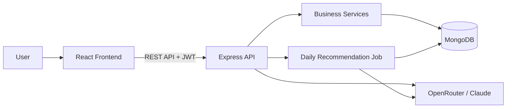

# FinTrack

> AI-powered personal finance management and digital wallet platform.

FinTrack helps users manage wallet transactions, understand spending patterns, create saving goals, receive data-grounded financial guidance, and respond to suspicious activity.

## Live Demo & Judge Access

- **Frontend:** [https://fin-track-app-jz1d.onrender.com/](https://fin-track-app-jz1d.onrender.com/)
- **Backend API health:** [https://fin-track-rsby.onrender.com/](https://fin-track-rsby.onrender.com/)

**Demo account**

```text
Phone: 01888888888
PIN: 1234
```

## Overview

### Problem

Managing personal money through separate payment apps, notebooks, or spreadsheets creates several practical problems:

- **Low spending visibility:** users can see individual transactions but cannot easily understand monthly totals, category patterns, or how spending has changed.
- **Delayed financial decisions:** by the time a user realizes that spending is increasing, most of the month may already be over.
- **Unclear saving plans:** users may have a target but no calculation of the required monthly saving amount or the spending limit needed to reach it.
- **Generic advice:** ordinary financial tips do not consider a user's actual income, expenses, budget, or recent transactions.
- **Unsafe transaction activity:** unusual amounts, new recipients, odd-hour activity, or rapid transactions can go unnoticed.
- **Disconnected wallet operations:** sending money, paying bills, recharging, cashing out, and reviewing history are often handled as unrelated activities.
- **Limited language flexibility:** users may describe transactions in English, Bangla, or Banglish, making manual categorization inconvenient.

These gaps make it difficult to answer important questions such as:

- Where did my money go this month?
- Am I spending faster than I can afford?
- Can I reach my saving target?
- Which categories should I reduce?
- Is this transaction normal for my account?

### Solution

FinTrack provides an integrated, user-focused solution instead of treating payments, budgeting, analytics, and security as separate systems.

1. **Centralized financial record:** wallet activities are stored as categorized transactions with amount, type, status, reference, and timestamp.
2. **Actionable analytics:** the system compares current and previous months, identifies category trends, and highlights spending above income.
3. **Goal-based budgeting:** users define a target and duration; FinTrack calculates the monthly saving requirement, allowed spending, category limits, and progress.
4. **Spending-pace intelligence:** current-month spending is projected across the full month. This allows the system to warn a user who spends heavily at the beginning of a month, even when the current total alone looks reasonable.
5. **Personalized AI guidance:** recommendations and chatbot responses are generated from verified, authenticated financial facts rather than generic assumptions.
6. **Reliable fallback behavior:** rules-based recommendations remain available when the LLM provider is unavailable or returns an unusable response.
7. **Proactive protection:** anomaly detection identifies suspicious transaction patterns and lets users confirm, deny, or follow up on alerts.
8. **Unified wallet experience:** common financial operations, transaction history, notifications, insights, and profile controls are available through one responsive interface.
9. **Flexible categorization:** notes and references can be interpreted in English, Bangla, or Banglish when a category is not supplied directly.

As a result, FinTrack turns raw transaction data into understandable financial context, timely warnings, and practical next actions while keeping authentication and user data boundaries in the backend.

## Key Features

### Authentication and accounts

- User registration and login with phone number and PIN.
- bcrypt PIN hashing and JWT authentication.
- Seven-day token expiry.
- General and merchant account types.
- Profile update and PIN change.
- Admin and manager roles for protected management operations.

### Wallet and transactions

- Send money, receive money, cash out, pay bills, recharge, make payments, and donate.
- Successful and failed transaction records.
- Failure reasons such as insufficient balance, invalid recipient, incorrect PIN, and service failure.
- Transaction history with amount, type, category, status, reference, and date.
- Authenticated user ownership checks.

### Analytics and budgeting

- Current- and previous-month income and expense summaries.
- Category-level spending comparison and trends.
- Spending change percentage and highest-spending categories.
- Saving goals with target, duration, monthly saving requirement, spending limit, and progress.
- Essential categories are protected before flexible spending is reduced.

### Alerts and notifications

- Large-amount, new-recipient, odd-hour, and rapid-transaction alerts.
- Alert severity, confidence, read state, and response tracking.
- Confirm, deny, ignore, or follow up on suspicious activity.
- Daily recommendation notifications scheduled for 8:00 AM Asia/Dhaka.

### Frontend experience

- Mobile-first responsive wallet interface.
- Dashboard, transaction history, analytics, budget, notifications, offers, profile, and alert screens.
- Balance visibility toggle and authenticated navigation.

## AI Features

### Spending recommendations

Recommendations are generated from verified backend facts, including:

- Category spending increases.
- Spending above income.
- Exceeded budget limits.
- Saving-goal progress.
- Current-month spending pace.
- Projected full-month spending compared with the previous month.

The system projects monthly spending from current spending, elapsed days, and the total number of days in the month. This prevents an early-month high-spending pattern from being incorrectly described as healthy. BDT values are rounded to practical amounts for clearer guidance.

If the LLM is unavailable, a rules-based fallback provides recommendations.

### Financial chatbot

The chatbot uses the authenticated user's:

- Profile and current balance.
- Recent successful transactions.
- Current- and previous-month summaries.
- Active budget progress.

Questions are limited to 2,000 characters and context is limited to 100 recent transactions from approximately six months. The prompt instructs the model to use verified facts, avoid invented amounts, and not reveal another user's data.

### AI safety and reliability

- Financial facts are prepared by the backend before the model call.
- Warning facts take priority over reassuring language.
- The model is not trusted for client-side calculations.
- Recommendations have a deterministic fallback when the provider fails.
- Transaction categories can be suggested from notes in English, Bangla, or Banglish.

## System Architecture



### Application layers

| Layer | Responsibility |
| --- | --- |
| Client | React UI, navigation, forms, authenticated API calls, and feedback. |
| Routes | HTTP contracts, authentication middleware, validation, and authorization. |
| Services | Transactions, analytics, budgets, anomalies, recommendations, and chatbot context. |
| Models | Mongoose schemas for users, transactions, budgets, alerts, and notifications. |
| External services | MongoDB persistence and OpenRouter-compatible LLM access. |

### Core entities

- **User:** phone, hashed PIN, account type, role, balance, and profile data.
- **Transaction:** sender, recipient, amount, type, category, status, reference, and timestamp.
- **Budget plan:** target, duration, monthly target, category limits, and progress.
- **Alert:** anomaly type, severity, confidence, related transaction, and response state.
- **Notification:** recommendation content, source, date, and read state.

## Technology Stack

### Frontend

- React 19 and React DOM
- Vite
- Tailwind CSS v4
- Lucide React
- Shadcn-related UI components
- Geist font

### Backend

- Node.js with ES modules
- Express 5
- Mongoose 9 and MongoDB
- JSON Web Token
- bcryptjs
- node-cron
- CORS and native `fetch`

### AI

- OpenRouter-compatible chat-completions API
- Claude model through OpenRouter, configurable with `LLM_MODEL`

## Requirements

- Node.js 18 or newer
- npm
- MongoDB Atlas or another reachable MongoDB instance
- OpenRouter-compatible API key for AI features
- Git for cloning the repository

## Installation and Setup

### 1. Clone and install

```bash
git clone https://github.com/m-sabrinaa/fin-track.git
cd fin-track

cd server
npm install

cd ../client
npm install
```

### 2. Configure the backend

Create `server/.env`:

```env
PORT=5000
MONGO_URI=<mongodb-connection-string>
JWT_SECRET=<strong-jwt-secret>
LLM_BASE_URL=https://openrouter.ai/api/v1/chat/completions
LLM_API_KEY=<openrouter-api-key>
LLM_MODEL=anthropic/claude-haiku-4.5
CLIENT_URL=http://localhost:5173
DAILY_JOB=on
NODE_ENV=development
```

### 3. Configure the frontend

The Vite development proxy uses `http://localhost:5000` by default. To override it, create `client/.env`:

```env
VITE_API_URL=http://localhost:5000
```

Do not append `/api`; the frontend API helper adds that path automatically.

Never commit `.env` files or real credentials.

## Run Commands

Start the backend:

```bash
cd server
npm run dev
```

Start the frontend in another terminal:

```bash
cd client
npm run dev
```

Local URLs:

```text
Backend:  http://localhost:5000
Frontend: http://localhost:5173
```

The backend `npm test` script is currently a placeholder; automated backend tests still need to be added.

## API Overview

Protected endpoints require:

```http
Authorization: Bearer <jwt-token>
```

### Authentication

```text
POST   /api/auth/users/register
POST   /api/auth/users/login
POST   /api/auth/users/logout
PATCH  /api/auth/users/change-pin
```

### Users and transactions

```text
GET    /api/user/me
PATCH  /api/user/me
GET    /api/user
GET    /api/user/:id
DELETE /api/user/:id
POST   /api/transaction
GET    /api/transaction
```

Collection and deletion endpoints require the appropriate role.

### Analytics and budgets

```text
GET    /api/analytics/summary
GET    /api/analytics/recommendations
POST   /api/budget
POST   /api/budget/preview
GET    /api/budget
```

### Alerts and notifications

```text
GET    /api/alerts
PATCH  /api/alerts/:id/read
PATCH  /api/alerts/:id/respond
PATCH  /api/alerts/:id/follow-up
POST   /api/alerts/:id/ticket
GET    /api/notifications
POST   /api/notifications/generate
PATCH  /api/notifications/:id/read
```

### Chatbot and bills

```text
POST   /api/chat
GET    /api/bill/providers
POST   /api/bill/pay
```

Example chatbot request:

```json
{
  "question": "How much did I spend this month?"
}
```

## Testing and Verification

### Health check

Start the backend and open `http://localhost:5000/`. Expected response:

```json
{
  "message": "AI Financial Guide API is running"
}
```

### Manual API flow

1. Register and log in.
2. Copy the returned JWT.
3. Use it as a Bearer token in Postman.
4. Call `GET /api/user/me`.
5. Create and list a transaction.
6. Check analytics and recommendations.
7. Create or preview a saving goal.
8. Check budget progress.
9. Test the chatbot.
10. Test alert and notification actions.

## Configuration Notes

- `CLIENT_URL` supports comma-separated frontend origins.
- Trailing slashes in configured origins are removed before matching.
- Set `DAILY_JOB=off` to disable the scheduled recommendation job.
- The job schedule is `0 8 * * *` in the `Asia/Dhaka` timezone.
- MongoDB network access must allow the backend environment to connect.
- Production secrets should be stored in a managed secret system.

## Production Readiness

The current project is suitable for demonstration and evaluation. Before operating it as a production financial service:

- Add backend unit, integration, and API contract tests.
- Add request validation, rate limiting, structured logs, monitoring, and alerting.
- Use managed secrets and rotate credentials regularly.
- Configure MongoDB restrictions, backups, indexes, and retention.
- Use a dedicated scheduler for daily recommendations.
- Review monetary arithmetic with decimal or minor-unit handling.
- Add audit logs for authentication, balance changes, PIN changes, administrative actions, and alert responses.
- Define privacy, retention, incident-response, and compliance policies.

## Security Notes

- Never commit `.env` files or API keys.
- Use a strong JWT secret.
- Rotate credentials if they are exposed.
- Restrict MongoDB network access where practical.
- Keep administrative endpoints protected by role authorization.
- Do not use the demo account for real financial activity.

## License

No license has been specified for this repository. Add an appropriate license before public distribution.
